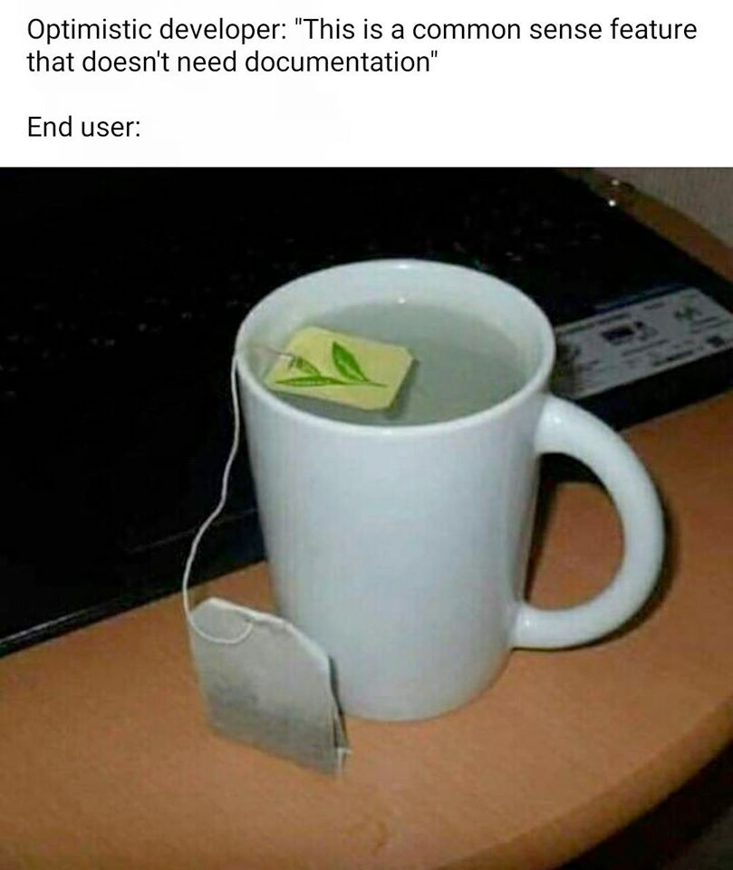

# Engagement

Adding random text to see if Stoplight updates itself.

Also adding a picture.

| Field        | Type      | Required | Description                                           |
| :----------- | :-------- | :------- | :---------------------------------------------------- |
| `id`         | `string`  | Yes      | Engagement ID.                                        |
| `started_at` | `string`  | Yes      | An ISO-8601 timestamp of when the Engagement started. |
| `audio_used` | `boolean` | Yes      | `true`, if audio is used in the Engagement.           |
| `video_used` | `boolean` | Yes      | `true`, if video is used in the Engagement.           |
