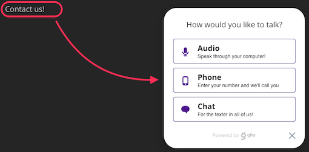

# HTML and CSS Customizations

## Cobrowsing

### Prevent Elements from Being Shown to the Operator

```html
<div class='sm_cobrowsing_hidden_field'>
  This element will not be displayed to the operator
</div>
...
<div class='sm_cobrowsing_hidden_field other-classes'>
  This element will not be displayed to the operator
</div>
...
<div class='other-classes sm_cobrowsing_hidden_field'>
 This element will not be displayed to the operator
</div>
...
<input class='other-classes sm_cobrowsing_hidden_field' other="...">
  <!-- This input field will not be shown to the operator -->
</input>
...
<form class='other-classes sm_cobrowsing_hidden_field' other="...">
  <!-- The entire form will not be displayed to the operator -->
</form>
```

To prevent elements from being shown in the operator's session during the
observation or engagement add the class `sm_cobrowsing_hidden_field` to the
desired `html` elements to be hidden.

### Prevent the Field's Value from Being Shown to the Operator.

```html
<form action="action" method="get">
  First name:
  <!-- This input field value will be shown as `*`(s) to the operator -->
  <input class="sm_cobrowsing_masked_field" type="text" name="first_name" />
  Last name:
  <!-- This input field value will be shown as `*`(s) to the operator -->
  <input
    class="sm_cobrowsing_masked_field last_name_class"
    type="text"
    name="last_name"
  />
  <input type="submit" value="Submit" />
</form>
```

To prevent a field value from being shown to the operator during observation or
engagement add the class `sm_cobrowsing_masked_field` to the desired `html`
elements.

### Disable Elements from Being Acted Upon by the Operator

```html
<form action="action" method="get">
  First name:
  <!-- The operator can see the field and its value but he/she can not modify the field value -->
  <input class="sm_cobrowsing_disabled_field" type="text" name="first_name" />
  Last name:
  <!-- The operator can see the field and its value but he/she can not modify the field value -->
  <input
    class="sm_cobrowsing_disabled_field last_name_class "
    type="text"
    name="last_name"
  />
  <input type="submit" value="Submit" />
</form>
```

To disable an element so the operator can not interact with it during an
observation or engagement add the class `sm_cobrowsing_disabled_field` to the
element\(s\).

## Custom Media Selection Trigger

```html
<!--
The link opens the media selection modal when the visitor clicks on it
-->
<a data-sm-show-media-selection-on="click" href="javascript:void(0);">
  Contact us!
</a>
...
<!--
The link opens the media selection modal when the visitor double-clicks on it
-->
<div data-sm-show-media-selection-on="dblclick">
  <h3>
    Double-click me to start an engagement!
  </h3>
</div>
```

It is possible to instrument any `html` element in the webpage to open the
`media-selection` modal. To set an element to behave as a Custom Media Selection
Trigger, add the `data-sm-show-media-selection-on` attribute with a string value
that is the name of the event that will trigger the `media-selection` modal.

As an example, if the `media-selection` modal should be open on a `double-click`
event on a `div` then such a `div` should look like
`<div data-sm-show-media-selection-on="dblclick"></div>`.

The following DOM events are supported:
[HTML DOM Events](http://www.w3schools.com/jsref/dom_obj_event.asp).



Notice that this type of widget cannot be configured using the Glia JS SDK.

### Hiding the Trigger When No Operators are Available

Sometimes it might be useful to hide the media selection trigger when there are
no operators available to actually answer the visitor. In such case you may add
extra piece of code to your website, to further control the trigger.

For example, to show the "Contact us!" text seen in the earlier example, only
when there are suitable queues available for the visitor, following lines of
JavaScript could be used:

```javascript
sm.getApi({version: 'v1'}).then(function(glia) {
  function onQueueStateUpdate(queueState) {
    const element = document.querySelector('[data-sm-show-media-selection-on]');
    if (queueState.state !== queueState.QUEUE_STATES.CAN_QUEUE) {
      element.style.display = 'none';
    } else {
      element.style.display = 'block';
    }
  }
  glia.addEventListener(glia.EVENTS.QUEUE_STATE_UPDATE, onQueueStateUpdate);
});
```

If adding such a code to your website is not possible, you can use Glia's
**Custom JavaScript** possibility as well, either by:

- updating the site via REST API's
  [`PUT https://api.salemove.com/sites/{id}`](sites.md#update-site), or
- adding the code to **Glia Hub > Settings > Developer**.

Apply this code to the trigger on your site by adding the `style` parameter:

```html
<!-- Add the link that, when clicked on, opens the media selection -->
<a
  data-sm-show-media-selection-on="click"
  href="javascript:void(0);"
  style="display: block;"
>
  Contact us!
</a>
```

## Hotlinks

A Hotlink is a URL with a hash at the end. The hash at the end of the URL
describes an action that is triggered when the visitor loads such an URL. A
Hotlink follows the pattern `http://[Client Domain]#[Action]`. As an example if
the visitor loads the URL `https://financialadvisor.com#sm_show_media_selection`
the media selection will be open when the visitor loads the
`financialadvisor.com` website.

### Open Media Selection Dialog

```html
<!--
With site address:      http://www.site.com
The ‘hotlink' would be: http://www.site.com#sm_show_media_selection
-->
...
<a href="http://www.site.com#sm_show_media_selection">...</a>
...
```

To open the media selection dialog as soon as the page loads add the hash
`#sm_show_media_selection` `URL-hash`. A typical use case for this action is to
open the `media-selection` dialog immediately after the visitor clicks on a link
and navigates to a new page.

## Queue Buttons

Glia supports defining multiple queues for one site. It might be desirable to
have multiple buttons, each bound to a specific queue, within your user
interface. This can be achieved by leveraging features from
[Glia JS API](https://js-sdk-docs.salemove.com). This section contains a
complete example of such an UI, including JavaScript that integrates the UI with
Glia JS API.

### User Interface

The example UI has two queues: Sales and Service. For each queue, 4 buttons with
different mediums are defined. There is also a general instructions element
which will be populated with text.

```html
<div>
  <div class="instructions"></div>
  <button class="cancel">Leave queue</button>
  <div class="queue" queue_name="Sales">
    <span> Interested in buying? </span>
    <button class="media_button" medium="text">Chat using your browser</button>
    <button class="media_button" medium="audio">
      Speak using your computer microphone
    </button>
    <button class="media_button" medium="phone">Speak using your phone</button>
    <button class="media_button" medium="video">
      Speak using your computer camera and microphone
    </button>
  </div>
  <div class="queue" queue_name="Service">
    <span> Need help with the product? </span>
    <button class="media_button" medium="text">Chat using your browser</button>
    <button class="media_button" medium="audio">
      Speak using your computer microphone
    </button>
    <button class="media_button" medium="phone">Speak using your phone</button>
    <button class="media_button" medium="video">
      Speak using your computer camera and microphone
    </button>
  </div>
</div>
```

### User Interface Selectors

A set of UI selectors are defined for later use.

```javascript
// The following functions define selectors for the example UI
// Replace these with selectors for your UI.

function findQueuingInstructionsElement() {
  return document.querySelector('div.instructions');
}

function findQueueElement(queueName) {
  return document.querySelector("div.queue[queue_name='" + queueName + "']");
}

function findAllQueueElements() {
  return document.querySelectorAll('div.queue');
}

function findAllQueueMediaButtons() {
  return document.querySelectorAll('div.queue > button.media_button');
}

function findMediaButtonsForQueue(queueElement) {
  return queueElement.querySelectorAll('button.media_button');
}

function findCancelButton() {
  return document.querySelector('button.cancel');
}

function getMediaButtonQueueName(button) {
  return button.parentElement.getAttribute('queue_name');
}

function getButtonMedium(button) {
  return button.getAttribute('medium');
}
```

### User Interface Transitions

The UI transitions are simplistic, using strike-through text, disabled buttons
and element hiding.

```javascript
// The following functions define simplistic user interface transitions.
// Replace these functions with functions that fit your user interface.

function hide(element) {
  element.style.display = 'none';
}

function show(element) {
  element.style.display = 'block';
}

function showCanQueue(queueElement, queueMedias) {
  // Queue is open, a set of medias available
  queueElement.style['text-decoration'] = 'none';
  updateQueueAvailableMedia(queueElement, queueMedias);
}

function showCannotQueue(queueElement) {
  // Queue is closed
  queueElement.style['text-decoration'] = 'line-through';
  updateQueueAvailableMedia(queueElement, []); // Disables all media buttons
}

function showCannotQueueAnywhere() {
  findAllQueueElements().forEach(showCannotQueue);
}

function showFailedToQueueView(error) {
  findQueuingInstructionsElement().innerText = 'Sorry! Currently unavailable.';
}

function showCanQueueView() {
  findQueuingInstructionsElement().innerHTML =
    'Please select a queue and click a media button';
}

function showAlreadyQueuedView() {
  findQueuingInstructionsElement().innerText =
    'Please wait, you will be connected shortly';
}

function showCannotQueueView() {
  findQueuingInstructionsElement().innerText = 'Queueing is currently disabled';
}

function updateQueueAvailableMedia(queueElement, medias) {
  findMediaButtonsForQueue(queueElement).forEach(function(button) {
    var mediaUnavailable = medias.indexOf(getButtonMedium(button)) === -1;
    button.disabled = mediaUnavailable;
  });
}
```

### Integration with Glia JS API

The following functions from Glia JS API are integrated with the user interface:

- [_queueForEngagement_](https://js-sdk-docs.salemove.com/class/Salemove.html#queueForEngagement-dynamic)

  is used to queue for a specific queue when a button is clicked. Queues are

  matched to buttons using the queue's name.

- [_QUEUE_STATE_UPDATE_ event](https://js-sdk-docs.salemove.com/class/Salemove.html#QUEUE_STATE_UPDATE-event)

  event is used

- [_getQueues_](https://js-sdk-docs.salemove.com/class/Salemove.html#getQueues-dynamic)

  is used to fetch all site's queues.

- [_subscribeToQueueStateUpdates_](https://js-sdk-docs.salemove.com/class/Salemove.html#subscribeToQueueStateUpdates-dynamic)

  is used to subscribe to updates of queues. Note that these updates do not

  dependent on visitor's state.

- [_QueueTicket.cancel_](https://js-sdk-docs.salemove.com/class/QueueTicket.html#cancel-dynamic)

  is used to cancel visitor's spot in the queue.

```javascript
// The following functions integrate an user interface with multiple queue
// buttons with Glia API.

var queueTicket; // Reference to an ongoing QueueTicket. Used for cancellation.

// Bind clicks on queue buttons with Glia API
function listenForQueueButtonClicks(salemove, queues) {
  findAllQueueMediaButtons().forEach(function(mediaButton) {
    // Gather properties from UI element
    var buttonQueueName = getMediaButtonQueueName(mediaButton);
    var buttonMedium = getButtonMedium(mediaButton);
    // Find queue ID by matching the queue name to button queue name
    var queueId = queues
      .filter(function(queue) {
        return queue.name === buttonQueueName;
      })
      .map(function(queue) {
        return queue.id;
      })[0];

    if (queueId === undefined) {
      throw new Error(
        'Queue button present, but queue not defined in Glia. Queue name: ' +
          buttonQueueName
      );
    }

    // Queue upon button click
    mediaButton.addEventListener('click', function() {
      if (buttonMedium === 'phone') {
        // Read the visitor's phone number from a separate UI element or from
        // another information source.
        var visitorPhoneNumber = '+11111111111';
        salemove
          .queueForEngagement(buttonMedium, {
            queueId: queueId,
            phoneNumber: visitorPhoneNumber
          })
          .catch(showFailedToQueueView);
      } else {
        salemove
          .queueForEngagement(buttonMedium, {queueId: queueId})
          .catch(showFailedToQueueView);
      }
    });
  });
}

// Bind click on cancel button with QueueTicket cancellation
function listenForCancel() {
  findCancelButton().addEventListener('click', function() {
    if (queueTicket) {
      queueTicket.cancel();
    } else {
      throw new Error('Cannot cancel queuing while not queued');
    }
  });
}

// Handle queue state changes for a particular queue.
// Enable queuing and media buttons for available media if open, disable
// otherwise.
function onQueueState(queue) {
  if (findQueueElement(queue.name) === null) {
    // Queue not related to the current page, ignore
  } else if (queue.state.status === queue.state.STATUSES.OPEN) {
    showCanQueue(findQueueElement(queue.name), queue.state.medias);
  } else {
    showCannotQueue(findQueueElement(queue.name));
  }
}

// Handle general visitor queuing state changes.
// Adapt this function to match your desired user interface.
// Note that these changes are for a particular visitor and must not conflict
// with the state that is written in `onQueueState` listener. Here two
// different dimensions, disabled and hidden, are used to avoid conflicts.
function onVisitorQueueingState(queuingState) {
  // Disable queuing if visitor is already queued.
  if (queuingState.state === queuingState.QUEUE_STATES.QUEUED) {
    queueTicket = queuingState.ticket;
    findAllQueueElements().forEach(hide);
    show(findCancelButton());
    showAlreadyQueuedView();
  } else if (queuingState.state === queuingState.QUEUE_STATES.CANNOT_QUEUE) {
    // Disable queueing when queueing state changed to `CANNOT_QUEUE`
    // which can happen due do various reasons.
    // See the full list of possible transition reasons in our JS SDK
    // https://js-sdk-docs.salemove.com/class/AggregateQueueState.html#TRANSITION_REASONS-variable
    queueTicket = null;
    findAllQueueElements().forEach(hide);
    hide(findCancelButton());
    showCannotQueueView();
  } else {
    // Enable queuing otherwise
    queueTicket = null;
    findAllQueueElements().forEach(show);
    hide(findCancelButton());
    showCanQueueView();
  }
}

// Initial state: Cannot queue and cannot cancel
showCannotQueueAnywhere();
hide(findCancelButton());

// Get Glia API and bind listeners.
sm.getApi({version: 'v1'}).then(function(salemove) {
  salemove.addEventListener(
    salemove.EVENTS.QUEUE_STATE_UPDATE,
    onVisitorQueueingState
  );
  listenForCancel();

  salemove.getQueues().then(function(queues) {
    listenForQueueButtonClicks(salemove, queues);

    var queueIds = queues.map(function(queue) {
      return queue.id;
    });
    salemove.subscribeToQueueStateUpdates(queueIds, onQueueState);
  });
});
```

## Custom Media Selection Button



**Deprecated.** Use either one of the following instead:

- The custom [Custom Media Selection Trigger](#custom-media-selection-trigger)
  together with custom code to check if any operators are available.
- The business rule to open `media-selection` together with custom code to check
  if any operators are available.



A Custom Media Selection Button is an element in the web page that when clicked
opens the `media-selection` modal. To add a Custom Media Selection Button it can
be a `div` or `span` element with the class `salemove-button`.

The button can be configured by means of the
[Glia JS-SDK.](http://js-sdk-docs.salemove.com) The following configuration
options are available:

| Parameter                  | Type       | Description                                                                                                                                                    |
| :------------------------- | :--------- | :------------------------------------------------------------------------------------------------------------------------------------------------------------- |
| `withOperatorsHtml`        | `string`   | Look and feel when there are operators available to handle the call.                                                                                           |
| `withoutOperatorsHtml`     | `string`   | Look and feel when there are no operator available to handle the call, leave empty string if you do not want to display anything when no operators are online. |
| `withoutOperatorsCallback` | `function` | A callback fired in the event that the visitor clicks on the Contact Operator Button and there are no operators available to handle the call.                  |

```html
// Place this DIV where the custom button should be displayed
<div class="salemove-button"></div>
```

```javascript
//Place the following script in the footer
sm.getApi().then(
  function(salemoveApi) {
    salemoveApi.setupContactOperatorButton({
      withOperatorsHtml: "",
      withoutOperatorsHtml: '',
      withoutOperatorsCallback: function() {}
    });
  },
  function(err) {}
);
```
